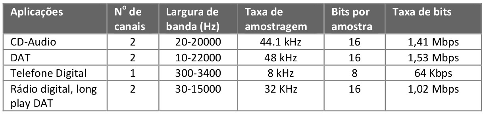

## Dados Multimídia

Para estudar os sistemas multimídia distribuídos, é necessário conhecer como as
diversas mídias são **representadas digitalmente**.

Algumas mídias principais são áudio, imagem, vídeo e texto. Focaremos mais em
mídias que não vemos muito durante o curso, como principalmente áudio, vídeo e
até textos.

* PDI → Imagem e vídeo;
* NLP (*Natural Language Process*) → textos.

## Áudio

* Áudio é causado por ondas mecânicas longitudinais que alcançam o tímpano;

* Ondas tranversais são ondas que a vibração para gerar a onda se da em uma
  direção; mas onda se propaga em uma direção perpendicular a vibração;

* Já ondas longitudinais são ondas que a vibração para gerá-las tem a mesma
  direção da propagação;

* Quando a frequência do distúrbio de ar está na faixa de 20 Hz (baixo) a
  20.000 Hz (alto) ele é audível. A maioria dos sistemas multimídia trabalha
  com esta faixa de frequência. Teste de audibilidade:
  [https://www.youtube.com/watch?v=H-iCZElJ8m0](
  https://www.youtube.com/watch?v=H-iCZElJ8m0);

* Outro parâmetro usado para a medição do som é a amplitude
  (medido em decibéis - dB). A variação que causa o som leve ou pesado
  (intensidade). Por exemplo, o limiar da dor é de 100 a 120 dB;

* Frequência = 1 / período;

* Frequência = velocidade * comprimento de onda;

* A onda sonora é uma onda contínua no tempo;

* O padrão de oscilação, como mostrado na Figura 1., é chamado de forma
  de onda (waveform);

**Figura 1.** Forma da onda.

* A forma de onda é caracterizada por um **período** e **amplitude**;

* O período é o tempo necessário para a realização de um ciclo, ou seja,
  intervalo de tempo que, num fenômeno periódico, separa a passagem do sistema
  por dois estados idênticos;

* Como a onda de som ocorre naturalmente, ela nunca é perfeitamente suave ou
  uniformemente periódica como a forma de onda da Figura 1.

* O timbre do som também caracteriza a onda (Figura 2.)

**Figura 2.** Diferentes formas que caracterizam
o timbre.

## Onda mecânica som para sinal elétrico e vice-versa

* Microfone e Alto-Falantes;

* Alto-Falante tem um imã e uma bobina móvel para receber o sinal elétrico variável,
  ao variar o sinal elétrico, a bobina se mexe devido ao imã ao seu redor,
  reproduzindo o sinal elétrico em ondas mecânicas devido a esse movimeto.

## Digitalização do Áudio

Para que sistemas computacionais processem e comuniquem sinais de áudio, o sinal
elétrico deve ser convertido em um sinal digital.

O mecanismo que converte o sinal de áudio digital em analógico é chamado de
**Conversor Analógico para Digital (CAD), ou digitalização**. Digitalização aqui
é o processo envolvido na transformação de sinais analógicos (sinal elétrico
gerado pelo microfone) em sinais digitais.

Esta conversão é realizada pelos dispositivos chamados de CODECs
(Codificador/Decodificador). Para a conversão de sinais analógicos em digital é
necessária a realização de três passos: amostragem, quantificação e codificação.

**Figura 3.** Conversão A/D:
(a) sinal analógico; (b) pulsos de amostragem; (c) valores amostrados e
intervalos de quantificação; (d) sequência digital.

## Amostragem

Nesta etapa um conjunto discreto de valores analógicos é amostrado em intervalos
temporais de periodicidade constante, como apresentado na Figura 3(a).

A freqüência de relógio é chamada de **taxa de amostragem ou freqüência de
amostragem**.

Cada uma das amostras é **analógica em amplitude**: ele tem qualquer valor em um
domínio contínuo. Mas isto é **discreto no tempo**: dentro de cada intervalo, a
amostra tem apenas um valor.

Segundo o teorema de Nyquist: se um sinal analógico contém componentes de
frequência até f Hz, a taxa de amostragem deve ser ao menos 2f Hz.

Se o sinal analógico tiver componentes de frequência maiores que a frequência de
Nyquist ocorre a pseudonímia ([*aliasing*](
https://en.wikipedia.org/wiki/Aliasing)). Nesta situação, estes componentes
maiores que 2f são convertidos em freqüências mais baixas na reconstrução.
Para evitar isto, são utilizados filtros anti-pseudonímia, trata-se de filtros
do tipo passa baixa para eliminar as frequências maiores que a de Nyquist.

Como filtros não são perfeitos, é necessário filtrar frequências um pouco maior
que 2f. Por exemplo, a taxa de amostragem de CD-audio é de 44,1 kHz, e dos tapes de
áudio digital (DAT) é de 48kHz para cobrir uma faixa audível de freqüência de 20 kHz.

O sistema telefônico foi projetado para transmitir frequências da voz humana.
A voz humana gera frequências entre **15Hz e 14kHz**.

Na telefonia, por razões econômicas, a faixa de voz escolhida foi entre 300 e
3400 Hz (largura de banda de 3,1kHz), o que garante 85% de inteligibilidade
(palavras compreendidas) e 68% de energia da voz humana.

No entanto, para evitar a interferência entre sinais que fluem em canais
vizinhos, a largura de banda de um canal de voz foi definida em 4KHz. No sistema
telefônico é comum usar uma **frequência de amostragem de 8 kHz** para converter
este sinal em digital.

## Quantificação

**O processo de converter valores de amostras contínuas em valores discretos é
chamado de quantificação**. Neste processo nós dividimos o domínio do sinal em
um número fixo de intervalos. Cada intervalo tem o mesmo tamanho e recebe um
número. Na Figura 3(c) estes intervalos são numerados de 0 a 7. A cada amostra
dentro de um intervalo é atribuído o valor do intervalo.

Quando o mesmo tamanho de passo de quantificação é usado na conversão A/D sem
olhar para a amplitude do sinal, o processo de conversão é dito uniforme. Este
processo de conversão A/D é chamado de modulação por pulso codificado
(PCM - *Pulse Coded Modulation*). Algumas vezes, nem todos os valores amostrados
são retidos após a quantificação. No caso ilustrado pela Figura 3(c), todos os
valores amostrados foram retidos.

* Para quantização uniforme valores em 8 bits → 256 níveis diferentes ou
16 bits → 65.536 níveis diferentes.

### Quantificação não linear

O PCM é simples, mas não é eficiente: a quantificação linear resulta em uma
mais elevada [SNR](
https://pt.wikipedia.org/wiki/Rela%C3%A7%C3%A3o_sinal-ru%C3%ADdo) na região de
amplitude de sinal mais altas que na região de mais baixas amplitudes. Esta
elevada SNR na região de amplitude mais altas não aumenta a qualidade percebida.
Isto, pois nós somos mais sensíveis às componentes de amplitude mais baixas.

* SNR medido em dB (decibel, assim como a amplitude do áudio). Quanto maior o
  valor, menor o ruído.

A fim de explorar este fato o tamanho de passo de quantificação que aumenta
logaritmicamente com a amplitude do sinal é muito usado na quantificação de
sinais de voz. Neste caso, os passos de quantificação são menores quando a
amplitude é baixa. Esta técnica de compressão realiza uma transformação de um
sinal linear em um sinal não linear (Figura 4.)

* **Lei de Weber:** descreve a relação entre as magnitudes físicas de um estímulo
  e a intensidade percebida deste estímulo:
    * Diferenças que são igualmente percebidas têm valores proporcionais em
    relação aos valores absolutos dos estímulos;
    * Exemplo: se podemos sentir um crescimento no peso de 5 para 6 Kg então,
    se ao invés, iniciarmos com 10 libras, então serão precisos 12 libras para
    sentirmos uma diferença.

* Como o ouvido humano percebe melhor frequências mais baixas, pode­-se usar uma
  quantização não uniforme para aumentar o número de amostras destas frequências
  mais baixas e diminuir o número de amostras das frequências mais altas.

* O [teste de audibilidade (vídeo)](https://www.youtube.com/watch?v=H-iCZElJ8m0)
  começa acelelar conforme o aumento das frequências.

**Figura 4.** Função linear x não linear (logaritmica).

## Filtragem de áudio

* Antes da amostragem e conversão analógicadigital (AD), o sinal de áudio é normalmente
filtrado para remover frequências indesejadas;

* As frequências que são mantidas **dependem da aplicação do sinal de áudio**;

* O tipo de filtro mais comumente empregado é o filtro passa­-banda
  (ou passa-­faixa) elimina → frequências mais altas e mais baixas, deixando
  intacta apenas uma banda de frequências.

* Quando um sinal digital é convertido para uma saída analógica (conversão DA),
  ele é novamente filtrado para eliminar frequências altas:

    * Um sinal quantizado é basicamente um sinal descontínuo. Teoricamente,
      entre uma descontinuidade e outra pode haver diversas frequências;

    * Usa-­se um filtro passa-­baixas eliminar altas­ → frequências.

## Codificação

A codificação consiste em associar um conjunto de dígitos binários, chamado de
*code-word*, a cada valor quantificado. No caso da Figura 3.(d), oito níveis de
quantificação são usados. Estes níveis podem ser codificados usando 3 bits,
assim cada amostra é representada por 3 bits.

## Taxa de bits

Taxa de bits é definida como o produto entre taxa de amostragem e o número de
bits usados no processo de quantificação.

* Por exemplo, supondo uma frequência de 8k Hz e 8 bits por amostra, a taxa
  de bits necessária à telefonia é igual a 8000x8 = **64 kbps**.

## Exemplos de qualidade de áudio digital

A tabela abaixo mostra a taxa de amostragem e o número de bits usados para cada
amostra para várias aplicações de áudio. Relembrando, quanto maior a taxa de
amostragem e maior o número de bits por amostragem, maior é a qualidade do áudio
restituído, mas com isso maior é a taxa de bits. Note na tabela que para áudio
estéreo, tal como CD-Audio, dois canais são necessários.

Hoje com a largura de banda que temos, podem teoricamente ouvir qualidade de
CDs pela internet; cerca de 15 anos atrás isso era completamente inviável.

## Referências

[http://www2.ufersa.edu.br/portal/view/uploads/setores/164/arquivos/SistemaMultimidia/aula07_audio_digital.pdf](
http://www2.ufersa.edu.br/portal/view/uploads/setores/164/arquivos/SistemaMultimidia/aula07_audio_digital.pdf)

